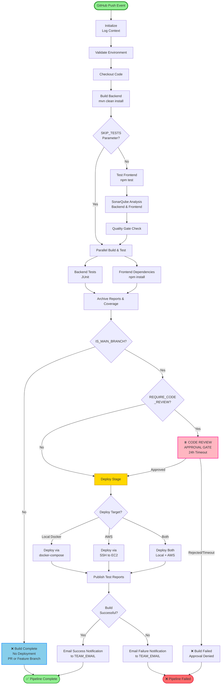

# SafeZone Jenkins Pipeline - Accurate Workflow



## Actual Pipeline Flow

### **Single Unified Path (All Branches)**
```
GitHub Push → Initialize → Validate → Checkout → Build Backend
    ↓
Tests (Frontend/Backend) → SonarQube → Quality Gate
    ↓
Parallel: Backend Tests + Frontend Dependencies
    ↓
Post-Build: Archive Reports
```

### **Decision Point: IS_MAIN_BRANCH?**

#### **If NOT Main (PR or Feature Branch)** ❌
- Build completes
- Tests all pass
- SonarQube passes
- **Pipeline stops here**
- No deployment
- Email notification sent

#### **If Main Branch** ✅
- Checks `REQUIRE_CODE_REVIEW` parameter
  
  **If Disabled:** Skip to Deploy
  
  **If Enabled:** 
  - ⏸️ **CODE REVIEW APPROVAL GATE** blocks pipeline
  - Waits for manual approval (24 hour timeout)
  - If approved → continues to Deploy
  - If rejected/timeout → pipeline fails

### **Deploy Stage** (Main Branch Only)
- Checks `DEPLOYMENT_TARGET` parameter:
  - **Local Docker**: docker-compose up
  - **AWS**: SSH deploy to EC2
  - **Both**: Deploy to both simultaneously

### **Post-Deployment**
- Publish test reports
- Send success/failure email
- Pipeline completes

---

## Key Differences from Diagram v1

| Aspect | v1 (Wrong) | v2 (Actual) |
|--------|-----------|-----------|
| **Initialize Stage** | 3 different branches | Single path, just logs context |
| **Test Flow** | Branches PR/Main/Feature | All branches same tests |
| **REQUIRE_CODE_REVIEW** | Goes to Deploy both ways | Blocks if enabled, continues if disabled |
| **Code Review Gate** | Just echoes, doesn't block | **Blocks pipeline until approved** |
| **Complexity** | Redundant decision nodes | Simple linear flow + 2 gates |

---

## Stage Execution Details

### **Always Run (All Branches)**
1. Initialize (1 min)
2. Validate Environment (2 min)
3. Checkout (3 min)
4. Build Backend (30 min)
5. Test Frontend (15 min) - unless SKIP_TESTS=true
6. SonarQube Analysis (10 min) - unless SKIP_TESTS=true
7. Quality Gate (5 min) - unless SKIP_TESTS=true
8. Parallel: Backend Tests (20 min) + Frontend Deps
9. Post-Build: Archive Reports (5 min)

**Subtotal: ~90 minutes**

### **Only on Main Branch (IS_MAIN_BRANCH=true)**
10. Code Review Approval Gate (if REQUIRE_CODE_REVIEW=true)
    - **Blocks here** until approved
    - 24 hour timeout
11. Deploy Stage (if REQUIRE_CODE_REVIEW=false OR approved)
    - Local Docker: ~5 min
    - AWS: ~30-60 min
    - Both: ~60 min
12. Post Actions: Email (1 min)

**Total for Main: ~90-150 minutes + approval wait time**

---

## Parameters Impact

| Parameter | Value | Behavior |
|-----------|-------|----------|
| `SKIP_TESTS` | true | Skip Test Frontend, SonarQube, Quality Gate |
| `SKIP_TESTS` | false | Run all tests (default) |
| `REQUIRE_CODE_REVIEW` | true | **Block at approval gate** (main only) |
| `REQUIRE_CODE_REVIEW` | false | Skip approval, go straight to Deploy (main only) |
| `DEPLOYMENT_TARGET` | Local Docker | Deploy locally only |
| `DEPLOYMENT_TARGET` | AWS | Deploy to AWS EC2 only |
| `DEPLOYMENT_TARGET` | Both | Deploy to both (parallel) |

---

## What Actually Happens

### Scenario 1: PR Push
```
GitHub → All tests run → SonarQube passes → Build Complete ✅
End (no deployment)
```

### Scenario 2: Feature Branch Push
```
GitHub → All tests run → SonarQube passes → Build Complete ✅
End (no deployment)
```

### Scenario 3: Main Branch, REQUIRE_CODE_REVIEW=true
```
GitHub → All tests run → SonarQube passes 
→ ⏸️ APPROVAL GATE (blocks here)
→ (someone approves) → Deploy → Email ✅
```

### Scenario 4: Main Branch, REQUIRE_CODE_REVIEW=false
```
GitHub → All tests run → SonarQube passes 
→ Skip approval → Deploy → Email ✅
```

---

**Last Updated**: January 19, 2026  
**Version**: 2.0 (Fixed - Accurate Pipeline Flow)
