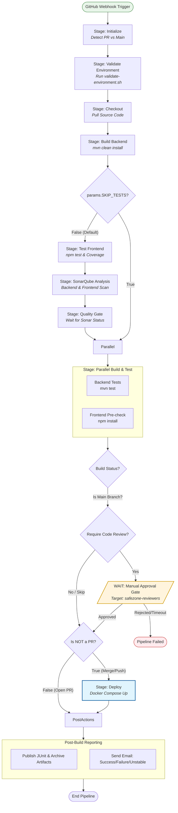

```mermaid
graph TD
    %% Entry and Initialization
    Start([GitHub Webhook Trigger]) --> Init[Stage: Initialize<br/><i>Detect PR vs Main</i>]
    Init --> ValEnv[Stage: Validate Environment<br/><i>Run validate-environment.sh</i>]
    ValEnv --> Checkout[Stage: Checkout<br/><i>Pull Source Code</i>]

    %% Build and Analysis
    Checkout --> BuildBack[Stage: Build Backend<br/><i>mvn clean install</i>]

    BuildBack --> SkipTestCheck{params.SKIP_TESTS?}

    SkipTestCheck -- "False (Default)" --> TestFront[Stage: Test Frontend<br/><i>npm test & Coverage</i>]
    TestFront --> Sonar[Stage: SonarQube Analysis<br/><i>Backend & Frontend Scan</i>]
    Sonar --> QGate[Stage: Quality Gate<br/><i>Wait for Sonar Status</i>]
    QGate --> Parallel

    SkipTestCheck -- "True" --> Parallel

    %% Parallel Execution
    subgraph ParallelBuild [Stage: Parallel Build & Test]
        direction LR
        JUnit[Backend Tests<br/>mvn test]
        npmInst[Frontend Pre-check<br/>npm install]
    end

    Parallel --> ParallelBuild
    ParallelBuild --> PostParallel{Build Status?}

    %% Post-Merge / Deployment Logic
    PostParallel -- "Is Main Branch?" --> ApprovalGate{Require Code Review?}

    ApprovalGate -- "Yes" --> ManualInput[/WAIT: Manual Approval Gate<br/><i>Target: safezone-reviewers</i>/]
    ApprovalGate -- "No / Skip" --> DeployCheck

    ManualInput -- "Approved" --> DeployCheck
    ManualInput -- "Rejected/Timeout" --> Failure([Pipeline Failed])

    %% Deployment Stage
    DeployCheck{Is NOT a PR?}
    DeployCheck -- "True (Merge/Push)" --> Deploy[Stage: Deploy<br/><i>Docker Compose Up</i>]
    DeployCheck -- "False (Open PR)" --> PostActions

    Deploy --> PostActions

    %% Global Post Actions
    subgraph PostStages [Post-Build Reporting]
        direction TB
        Results[Publish JUnit & Archive Artifacts]
        Notify[Send Email: Success/Failure/Unstable]
    end

    PostActions --> PostStages
    PostStages --> End([End Pipeline])

    %% Styling
    style ManualInput fill:#fff4dd,stroke:#d4a017,stroke-width:2px
    style Deploy fill:#e1f5fe,stroke:#01579b,stroke-width:2px
    style Failure fill:#ffebee,stroke:#c62828
    style Start fill:#e8f5e9,stroke:#2e7d32
```
